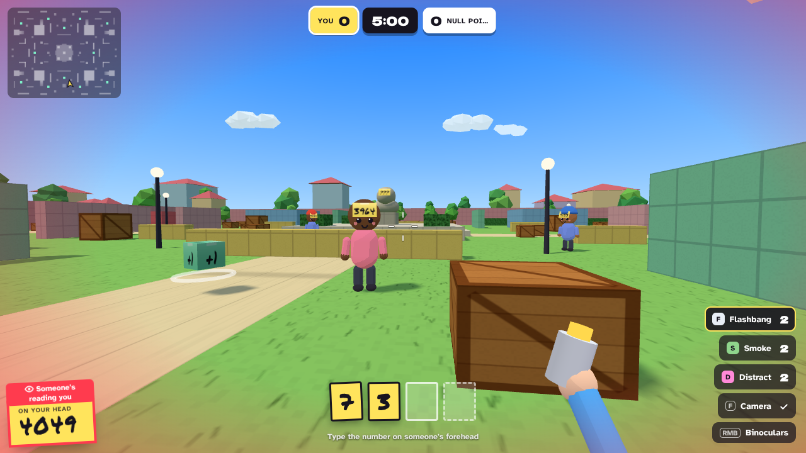

# Numbskull

**Read their forehead. Type the number. They're out.**

Numbskull is a free, open-source first-person party shooter that runs in any modern browser. Everybody has a number stuck to their forehead. Get a clear look at someone's face, type their number on your keyboard, and they pop into confetti. No guns, no aiming, just reading under pressure.

Play against bots on your own, or open an online room and have up to 20 people join with a 4-letter code. No accounts, no installs, no servers to run.



## Play

**[Play now at r1shab17.github.io/numbskull](https://r1shab17.github.io/numbskull/)**

- **With friends:** one person picks **Host a room** and shares the 4-letter code. Everyone else picks **Join a room** and types it.
- **Offline:** download `docs/index.html` and open it. It's a single self-contained file (about 0.9 MB) and works without internet against bots.

## How it works

1. Everyone has a number on their forehead. You get a new one every life.
2. Look someone in the face, read their number and type it on the number keys.
3. If they're in your view when you hit the last digit, they're out.
4. Typing a wrong number jams you for a moment. Typing a teammate's number does nothing.
5. Numbers blur with distance. Binoculars let you read and take people out from far away.
6. People can only read *your* number when you face them. Turn away, duck behind low walls, throw smoke.

### Modes

| Mode | Goal |
| --- | --- |
| Deathmatch | Every head for themselves. First to the read limit wins. |
| Team Deathmatch | Red vs Blue. Team score to win. |
| Capture the Flag | Grab the enemy flag and bring it home. Your own flag has to be at your base to score. |

### Maps

- **Sticky Plaza** – sunny town square with rooftops, hedges and a suspicious statue.
- **Cardboard Depot** – warehouse aisles, loading docks and short sightlines.
- **Neon Rooftops** – dusk over the city, high ground, big drops and glowing signs.

### Gadgets

| Gadget | What it does |
| --- | --- |
| Flashbang | Whites out everyone looking at it. Blinded players can't read or type anyone out. |
| Smoke | A thick cloud nobody can read through. |
| Distract | Beeps and projects a *fake* number. Bots stare at it; typing the fake number jams you. |
| Binoculars | Zoom in to read and take out distant targets. You move slowly while using them. |
| Camera | Snap a photo that stays on screen for a few seconds so you can read numbers at your own pace. |

Mint-green crates around each map refill gadgets.

### Controls

| Key | Action |
| --- | --- |
| `0`–`9` | Type a number (number row or numpad) |
| `Backspace` | Delete a digit |
| `WASD` / mouse | Move / look |
| Right mouse (or hold `X`) | Binoculars |
| Left mouse (or `G`) | Throw the selected gadget |
| `Q` / `E` / wheel | Switch gadget |
| `F` | Camera |
| `Shift` / `C` / `Space` | Sprint / duck / jump |
| `Tab` | Scores |
| `T` or `Enter` | Chat (online) |
| `Esc` | Pause |

Phones and tablets get a virtual joystick, a look pad and an on-screen keypad. Play in landscape.

## Develop

Requires Node 18+.

```bash
npm install
npm run dev      # rebuilds on save, serves http://localhost:8080
npm run build    # writes docs/index.html (one self-contained file)
npm run sim      # bot-vs-bot balance simulation, no browser needed
```

`npm run sim -- ctf neon 12 hard 600` runs a 10-minute Capture the Flag match on Neon Rooftops with 12 hard bots and prints reads per minute, captures and what the bots spent their time doing.

### Project layout

| File | What it does |
| --- | --- |
| `src/config.js` | Every tuning number: ranges, timings, gadgets, bot skill levels |
| `src/maps.js` | The three maps, described as boxes (mirrored so both teams get the same side) |
| `src/world.js` | Collision, character movement, line of sight, navigation grid and A* |
| `src/game.js` | The match: rules, kills, gadgets, flags, scoring, network snapshots |
| `src/bot.js` | Bot brains: reading, typing (with typos), flanking, evading, using gadgets |
| `src/scene.js`, `src/avatar.js`, `src/effects.js`, `src/render.js` | three.js visuals |
| `src/hud.js`, `src/ui.js`, `src/style.css`, `src/body.html` | HUD and menus |
| `src/net.js`, `src/session.js` | Online rooms (host and client) |
| `src/audio.js` | Every sound effect, synthesised live with WebAudio (no audio files) |
| `src/input.js` | Keyboard, mouse and touch |
| `build.mjs` | Bundles everything (code, styles, fonts) into one HTML file, `docs/index.html` |

The simulation (`game.js`, `world.js`, `bot.js`, `maps.js`, `config.js`) has no browser dependencies, which is why the balance simulator runs in plain Node.

### Adding a map

Maps are lists of boxes. Add a function to `src/maps.js` that returns the same shape as the others, register it in `MAPS` and `MAP_LIST`, and the navigation grid, minimap and collision are generated from it automatically. Run `npm run sim -- dm yourmap 8` to check the bots can get around.

## Online play

Online rooms are peer-to-peer. The host's browser runs the match (bots, rules and kill checks) and every other player connects straight to it over WebRTC. [PeerJS](https://peerjs.com) is used only to introduce the browsers to each other, through its free public server.

- Rooms hold up to 20 players including bots. People can join a match already in progress.
- If the host leaves, the room closes.
- A few very strict networks (some offices and schools) block direct browser-to-browser connections. Playing from home networks and phones normally works.
- Online rooms don't work when the game is embedded somewhere that blocks WebRTC. Hosting the page yourself avoids that.

To use your own signalling server instead of the public one:

```bash
npx peer --port 9000 --path /numbskull
```

then open the game with `?signal=https://your-server.example:9000/numbskull`, or set `window.NUMBSKULL_SIGNAL` before the game script.

## Publish your own copy on GitHub Pages

1. Fork or push this repository to GitHub.
2. Open **Settings → Pages**, set **Source** to **Deploy from a branch**, pick `main` and the `/docs` folder, and save.
3. After a minute it's live at `https://<you>.github.io/<repo>/`. Run `npm run build` and commit `docs/index.html` whenever you change the code.

## Credits

- Inspired by the forehead-number idea behind *Figure Me Out* by Solo Groove Games. Numbskull is an independent fan project with its own code, art and name, and isn't affiliated with them. If you like the idea, go wishlist their game.
- [three.js](https://threejs.org) (MIT) for 3D rendering, [PeerJS](https://peerjs.com) (MIT) for online rooms.
- Fonts embedded from Fontsource: Dela Gothic One (SIL OFL), Permanent Marker (Apache 2.0), Atkinson Hyperlegible (SIL OFL).

## License

MIT. See [LICENSE](LICENSE). Contributions welcome: open an issue or a pull request.
